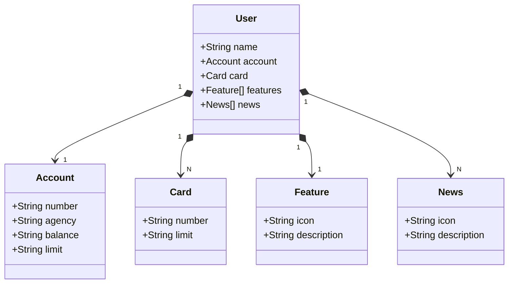

# SANTANDER API

## DIAGRAM CLASS 

```mermaid
classDiagram
  class User {
    +String name
    +Account account
    +Card card
    +Feature[] features
    +News[] news
  }

  class Account {
    +String number
    +String agency
    +String balance
    +String limit
  }

  class Card {
    +String number
    +String limit
  }

  class Feature {
    +String icon
    +String description
  }

  class News {
    +String icon
    +String description
  }

  User "1" *--> "1" Account
  User "1" *--> "N" Card
  User "1" *--> "1" Feature
  User "1" *--> "N" News
```
